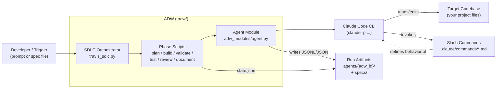
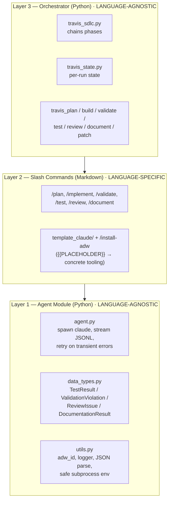
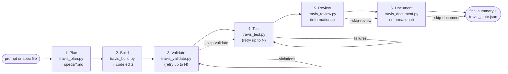
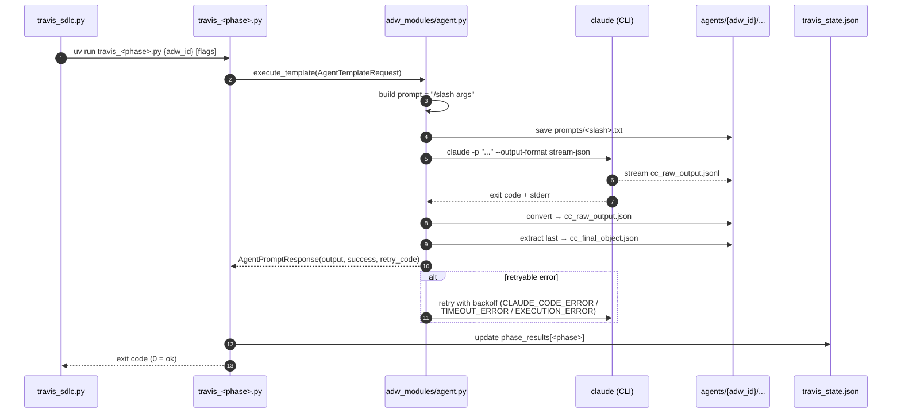
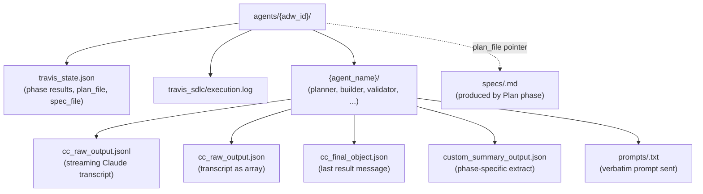

# ADW Architecture

A reference diagram and shared vocabulary for talking about the **Agentic Developer Workflow (ADW)** solution that lives under `.adw/`.

The diagrams below are written in [Mermaid](https://mermaid.js.org/) and render in GitHub, VS Code (with a Mermaid plugin), and most modern Markdown viewers.

---

## 1. System context — where ADW sits

ADW is the glue between a human (or upstream automation) and the Claude Code CLI. It turns a single prompt into a full SDLC pass over a target codebase.

**Read this as:** the human hands a prompt to the orchestrator; the orchestrator runs phase scripts in order; each phase script asks the agent module to spawn Claude Code with a specific slash command; Claude Code edits the target repo and emits a JSONL transcript that ADW captures as run artifacts.

---

## 2. The three-layer stack

The codebase is intentionally split so that **only one layer is language-specific**. This is the lever that lets the same orchestrator drive Go, TypeScript, Python, etc.

**Why this matters when explaining the system:**

- Adding a new language only touches **Layer 2** (write/populate slash commands).
- `template_claude/` + `/install-adw` is the bootstrap path that turns generic placeholders into a project-specific Layer 2.
- Layers 1 and 3 are stable plumbing — they should rarely change to support a new project.

---

## 3. SDLC phase pipeline

This is the canonical happy path. The orchestrator runs phases sequentially; **Plan** and **Build** are required, the rest can be skipped via flags. **Validate** and **Test** have built-in retry loops; **Review** and **Document** run even if Test failed (they're informational).

**Phase responsibilities (one line each):**

| # | Phase | Script | Purpose | Required? |
|---|-------|--------|---------|-----------|
| 1 | Plan | `travis_plan.py` | Research codebase, produce a spec under `specs/` | yes |
| 2 | Build | `travis_build.py` | Implement the spec against the codebase | yes |
| 3 | Validate | `travis_validate.py` | Run linters/static analysis; auto-fix and retry | optional |
| 4 | Test | `travis_test.py` | Run test suite; auto-fix failures and retry | optional |
| 5 | Review | `travis_review.py` | Compare implementation vs. spec; flag issues | optional |
| 6 | Document | `travis_document.py` | Generate docs for what was built | optional |

`travis_patch.py` is a sibling utility, not part of the linear pipeline — it applies targeted patches outside a full SDLC run.

---

## 4. How a single phase actually runs

Every phase looks roughly the same under the hood. This sequence diagram is the one to reach for when someone asks *"what happens when a phase executes?"*.

**Things worth pointing out when walking someone through this:**

- Each phase is launched as its own `uv run` **subprocess**, so phases are isolated and individually re-runnable with the same `adw_id`.
- The contract between Layer 3 and Layer 1 is the small set of Pydantic models in `agent.py` (`AgentTemplateRequest`, `AgentPromptResponse`, `RetryCode`).
- Retries live in **two places**: low-level (Claude CLI flakiness, in `agent.py`) and high-level (validation/test fix-it loops, in the phase scripts via `--max-*-retries`).

---

## 5. Run artifacts & state layout

Every workflow run is keyed by a short `adw_id` (8 hex chars). Everything that run produces lives under one directory, which makes runs trivially comparable and discardable.

**Conventions:**

- `adw_id` is generated by `make_adw_id()` (or passed in to resume/replay a run).
- Phase scripts only persist *summary* results to `travis_state.json` — the raw transcripts stay in the per-agent subdirectories so state stays small and diff-friendly.
- `specs/` lives at the project root, not under `agents/`, because specs are the durable hand-off between Plan and Build (and a useful artifact on their own).

---

## 6. Glossary — names to use in conversations

Use these terms consistently when discussing the system; they map 1:1 onto files/concepts above.

| Term | Means |
|---|---|
| **ADW** | Agentic Developer Workflow — the whole framework under `.adw/` |
| **Orchestrator** | `travis_sdlc.py` — chains phases for one workflow run |
| **Phase** | One step in the SDLC pipeline (Plan, Build, Validate, Test, Review, Document) |
| **Phase script** | The `travis_<phase>.py` file that executes a single phase |
| **Agent module** | `adw_modules/` — language-agnostic Claude Code wrapper + types + utils |
| **Slash command** | A Markdown file under `.claude/commands/` invoked as `/name`; Layer 2 of the stack |
| **Template** | `template_claude/` — placeholder slash commands populated by `/install-adw` |
| **adw_id** | 8-char run identifier; namespaces all artifacts for one workflow execution |
| **Run artifacts** | Everything under `agents/{adw_id}/` — transcripts, logs, state, prompts |
| **Spec** | Plan output Markdown under `specs/`; the contract Build implements and Review checks |
| **State** | `travis_state.json` — minimal cross-phase memory for one run |
| **Retry code** | `RetryCode` enum classifying CLI errors as retryable or terminal |

---

## 7. Suggested talking-points outline

When presenting the system, this order tends to land well:

1. **What problem does it solve?** — turn a single prompt into a complete, repeatable SDLC pass with auditable artifacts.
2. **Show diagram §1** (system context) — establish the boundary: ADW sits between the human and Claude Code.
3. **Show diagram §2** (three layers) — explain the language-portability story; this is the architectural commitment.
4. **Show diagram §3** (phase pipeline) — walk through what each phase produces and which can be skipped.
5. **Show diagram §4** (single-phase sequence) — for the audience that wants to know "but how does it actually work?".
6. **Show diagram §5** (artifacts) — close with reproducibility/observability: every run is a directory you can read, diff, or throw away.
